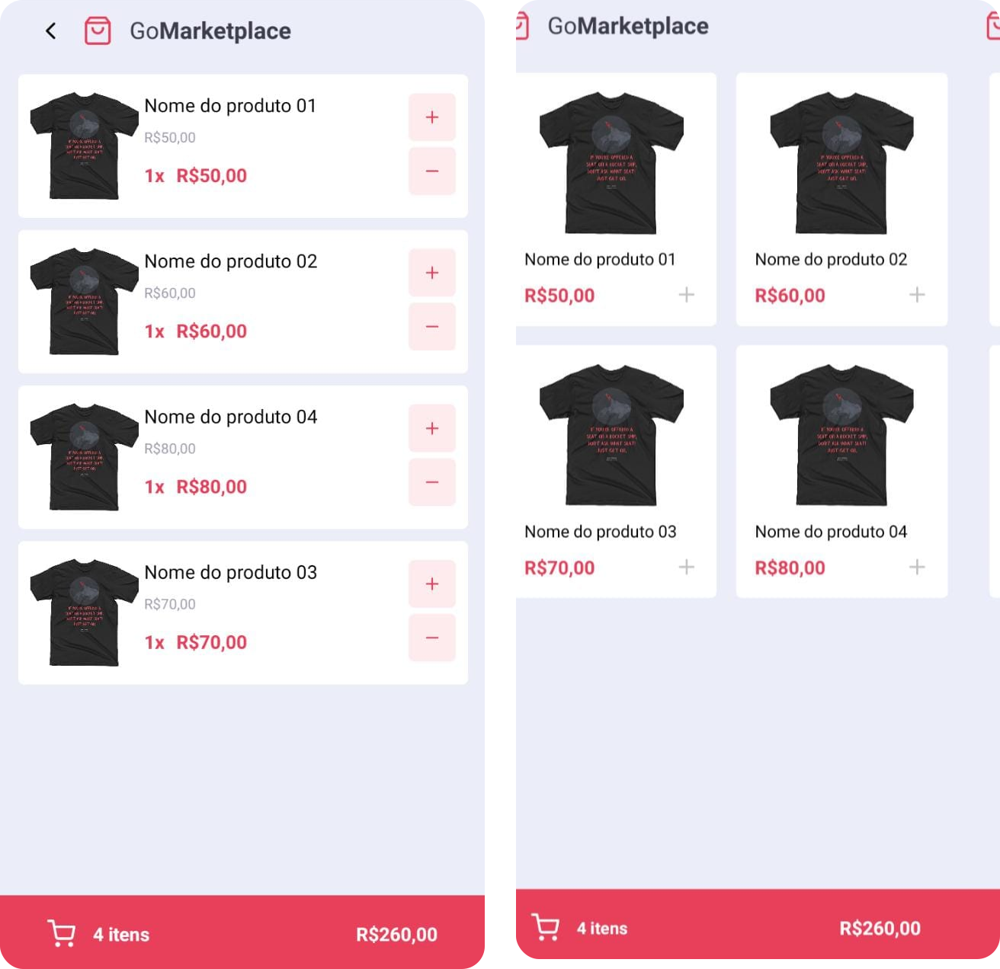

  

<h3 align="center">Go Market Place</h3>

---

 Few lines describing your project.
     

## 📝 Índice

- [Sobre](#about)
- [Começando](#getting_started)

## 🧐 Sobre 

 </a>

Aplicação Go Market Place é um mine e-commerce onde foi consumida uma api fake, feita com React Native e typescript.

## 🏁 Começando 

Pode tambpem rode em um disponivél fisíco. Para isso é necessário que ele esteja com a <strong>Depuração USB habilitada</strong>. Com o seu disponível fisíco conectado no seu celular va até configurações/Sitema/Sobre/Informação do software/Número de versão. Feito isso vai aparecer no que você já um desenvolvedor, logo após pode ir até sitemas/Opção do desenvolvedor e avitar a primera opção e a Depuração USB.

Feito isso, vá até o seu terminal/prompt e executa o comando

$ adb devices

ele deve retornar algo parecido com isso

"List of devices attached
14ed2fcc device # Dispositivo físico"

Abre dois terminais/prompt

- terminal/prompt 1

$ yarn start
ou
$npm start

- terminal/promp 2

$ npx react-native run-android

<pre>#Clone esse repositório
$ git clone https://github.com/Yan-pg/goMarketplace-react-native.git
 

#Navengue até a pasta
$ cd goMarketplace-react-native

#Instale as depedências
$ yarn
ou
$npm install

#Rode a api fake
$ yarn json-server server.json -p 3333

#Rode o app
$ react-native run-android</pre>

ou
$ npx react-native run-ios
</pre>

## ⛏️ Built Using 

- [React Native](https://reactnative.dev/) - Framework

Made with <g-emoji class="g-emoji" alias="purple_heart" fallback-src="https://github.githubassets.com/images/icons/emoji/unicode/1f49c.png"></g-emoji> by Yan César <g-emoji class="g-emoji" alias="wave" fallback-src="https://github.githubassets.com/images/icons/emoji/unicode/1f44b.png"></g-emoji>
